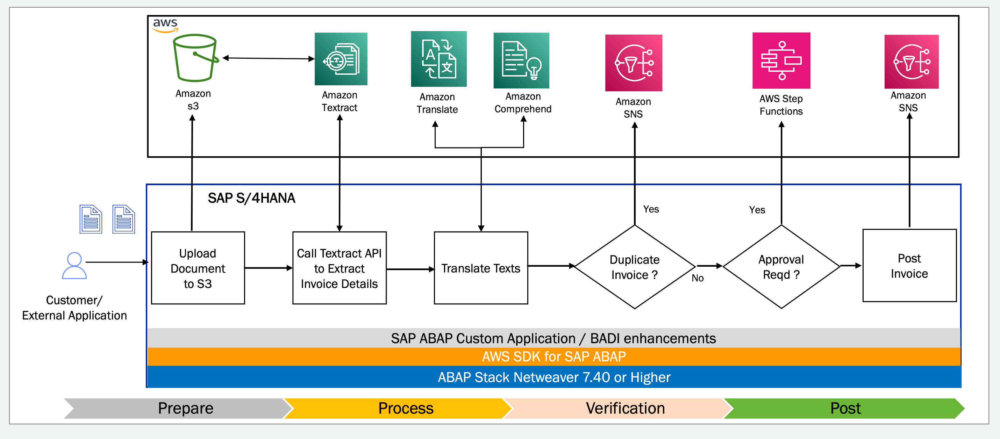
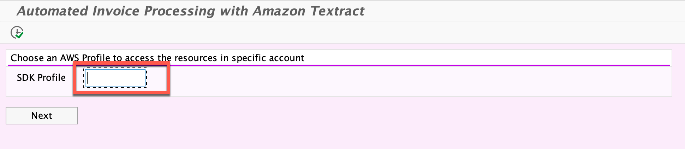
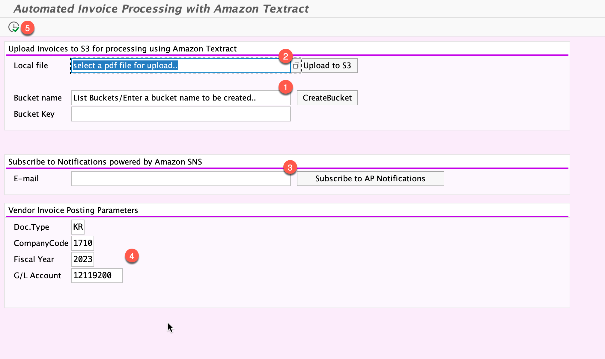
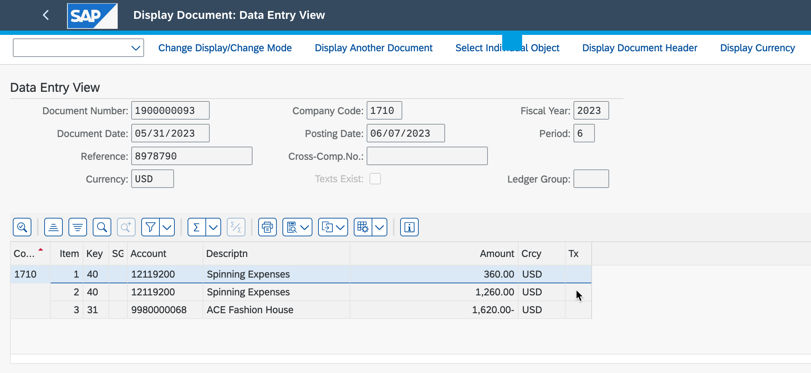

**Automate your paper-to-post invoice management process using the AWS SDK for SAP ABAP.**

Manual document processing is time-consuming and error-prone. Intelligent Document Processing techniques have grown tremendously, allowing us to extract, classify, identify, and process unstructured data. With ML powered services such as Amazon Textract building an IDP solution has become much easier and doesn’t require specialized ML skills.

In this post, we will walk through how you can use the AWS SDK for SAP ABAP to combine SAP with AI/ML-powered AWS services like Amazon Textract, Amazon Translate, Amazon Comprehend, and Amazon SNS to automatically process and post invoices in SAP as they are received from your vendor. This solution supports formats including PDF, documents, and images.

**Architecture**

This project is intended to be sample code only. Not for use in production.



This repo contains the following artifacts
- A demo executable program **ZAWS_SDK_IDP_DEMO** that interacts with AWS services including Amazon S3, Amazon Textract, Amazon Translate, and Amazon Comprehend using the AWS SDK for SAP ABAP for intelligently extracting data from PDF invoices and processing it in SAP.

- An ABAP utility class **ZCL_AWS_TEXTRACT_HELPER** that acts like a facade for calling the Amazon Textract AnalyzeDocument API leveraging the AWS SDK for SAP ABAP asynchronously and lets you parse the results returned by the Amazon Textract API in ABAP format. Simply pass any PDF documents or images to this helper class.

- ABAP utility class **ZCL_AWS_S3_HELPER** which allows you to list buckets, create bucket, put bucket operation that leverages the AWS SDK for SAP ABAP 

**Prerequisites**


- An AWS account with appropriate IAM permissions to create and manage S3 buckets, SNS topics, and access the Amazon Textract, Amazon Translate, and Amazon Comprehend service.

- Create an SNS topic with the name 'sap-ap-notifications' from the Amazon SNS console

- SAP ERP / S/4HANA system with SAP NetWeaver version 7.40 or higher.

- The AWS SDK for SAP ABAP is installed on the SAP ERP or S/4HANA system. For instructions on installing and configuring your SAP system with the AWS SDK for SAP ABAP, please refer to the guide here.

- Import the ABAP SDK client libraries that include Core, Amazon Textract, Amazon Translate, Amazon Comprehend and Amazon SNS

- Knowledge of SAP ABAP programming.

**Executing the Sample program**

- Run the program ZAWS_SDK_IDP_DEMO from SE38.

- Enter the SDK profile that was configured as part of the technical setup.



- Create a bucket, upload a sample invoice to the bucket in PDF format, subscribe to the SNS topic for receiving notifications, enter the G/L account details, and execute the program to post the vendor invoice in SAP. Ensure to create the vendor master and G/L account in SAP for posting the invoice.  A sample invoice document has been provided in the repository under the samples folder for you to edit and save in PDF format.



- Verify the vendor invoice after successful posting using transaction FB03



**Code Examples**

Interacting with AWS services using the SDK for SAP ABAP requires only a few lines of code, but it provides a great developer experience that encapsulates all the architectural complexities. 

Create an S3 bucket using the AWS SDK for SAP ABAP

```
Data(lo_session) = /aws1/cl_rt_session_aws=>create(
                   Iv_profile_id = co_profile ).

Data(lo_s3) = /aws1/cl_s3_factory=>create( lo_session ).

lo_s3_client->createbucket(
    EXPORTING
    iv_bucket = p_bucket
    RECEIVING
    oo_output = DATA(lo_bucket)
).
```
Translate texts using Amazon Translate using automatic language detection

```

DATA(lo_xl8)     = /aws1/cl_xl8_factory=>create( lo_session ).

  CALL METHOD lo_xl8->translatetext
    EXPORTING
      iv_text               = pv_desc
      iv_sourcelanguagecode = 'auto'    " will use comprehend to do lang detection
      iv_targetlanguagecode = 'de'
    RECEIVING
      oo_output             = DATA(lo_output).

 DATA(lv_trans_desc) = lo_output->get_translatedtext( ).


```
You can use the Amazon Textract helper utility for analyzing documents asynchronously, which leverages the AWS SDK for SAP ABAP.

```
* call the Analyzedocument API in Asynchronous mode
 DATA(lo_textract) = NEW zcl_aws_textract_helper( iv_profile = 'demo').

  TRY.
      DATA(lv_jobid) = lo_textract->analyze_document_asynchronous(
          iv_bucket = p_bucket
          iv_key    = p_key
      ).

      MESSAGE i016(rp) WITH |Document Analysis started| |Mode Asynchronous|.

    CATCH /aws1/cx_texaccessdeniedex.
    CATCH /aws1/cx_texbaddocumentex.
    CATCH /aws1/cx_texdocumenttoolargeex.
    CATCH /aws1/cx_texidempotentprmmis00.
    CATCH /aws1/cx_texinternalservererr.
    CATCH /aws1/cx_texinvalidkmskeyex.
    CATCH /aws1/cx_texinvalids3objectex.
    CATCH /aws1/cx_texlimitexceededex.
    CATCH /aws1/cx_texprovthruputexcdex.
    CATCH /aws1/cx_texthrottlingex.
    CATCH /aws1/cx_texunsupporteddocex.
    CATCH /aws1/cx_texclientexc.
    CATCH /aws1/cx_texserverexc.
    CATCH /aws1/cx_rt_technical_generic.
    CATCH /aws1/cx_rt_service_generic.
  ENDTRY.


```

Get the response of the AnalyzeDocument API results and its status asynchronously

```
DATA(lv_status) = lo_textract->get_document_results_asynch( im_jobid = lv_jobid ).
```
Retrieve the key value pairs from the document 

```
data(lt_key_value_pair) = lo_textract->get_form_data( )
```
Get table data with row index, column index and cell values

```
data(lt_tables) = lo_textract->get_table_data( )

```
Retrieve the words or lines of the document

```
data(lt_words) = lo_textract->get_words( )

data(lt_lines) = lo_textract->get_lines( )

```

Enjoy!
